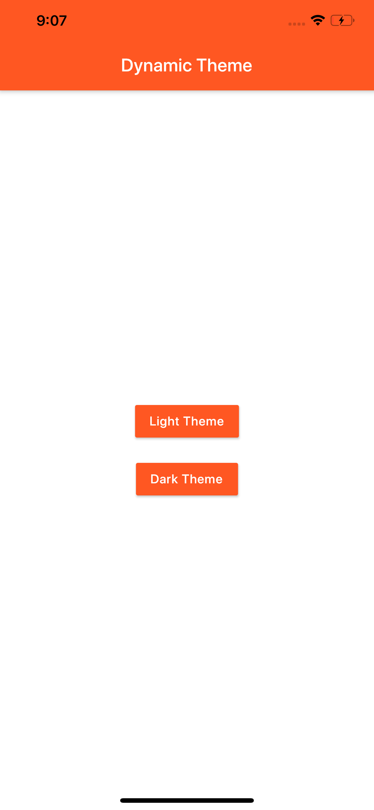
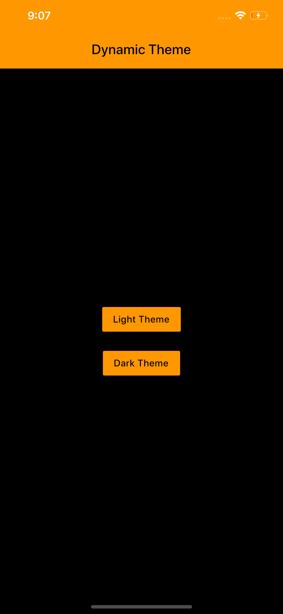

# Flutter Dynamic Theme Example

A new Flutter project to achieve dynamic theme functionality using packages.
Implementation tutorial can be found at - [App With Flutter](https://www.appwithflutter.com)

## Packages Used

- [Dynamic Theme Package](https://pub.dev/packages/dynamic_theme)
- [SharedPreference](https://pub.dev/packages/shared_preferences)

## Screenshots

